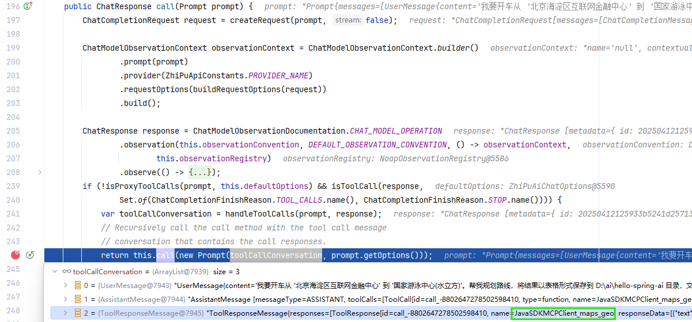

# hello-spring-ai

| spring-ai-integration | RAG  | Tool Calling | Spring AI Message |
| --------------------- | ---- | ---------------- | ----------------- |
|                       |      |                  |                   |

## Run

```sh
touch .env
```

```env
ZHIPUAI_API_KEY=智谱大模型APIKEY
AMAP_MAPS_API_KEY=高德地图APIKEY
```

### Run Mcp Server

```sh
cd mcp-server
mvn spring-boot:run
```

### Run Mcp Client

```sh
$ cd mcp-client

# Hello Mcp
$ mvn test "-Dtest=org.feuyeux.ai.hello.McpTests#testHelloMcp"
17:00:57.575 [o.f.a.h.McpTests] QUESTION: 列出元素周期表的第14个元素的详细信息
17:01:02.017 [o.f.a.h.McpTests] ASSISTANT: 元素周期表的第14个元素的详细信息如下：

- 元素名称：硅（Silicon）
- 原子序数：14
- 符号：Si
- 相对原子质量：28.085
- 周期：3
- 族：IVA

# Filesystem Mcp
$ mvn test "-Dtest=org.feuyeux.ai.hello.McpTests#testFSMcp"
17:04:25.348 [o.f.a.h.McpTests] FS QUESTION: Can you explain the content of the Periodic_table.md in D:\ai\hello-spring-ai\mcp-client?
17:04:43.857 [o.f.a.h.McpTests] FS ASSISTANT: The "Periodic_table.md" file in the "D:\ai\hello-spring-ai\mcp-client" directory provides a detailed explanation of the periodic table of elements. It covers the history, structure, and variations of the periodic table, as well as periodic trends such as atomic radius, ionization energy, electron affinity, valence and oxidation states, electronegativity, and metallicity. The file also discusses the classification of elements, including group names and numbers, presentation forms, and electron configurations. It further explores variations in the periodic table, such as the placement of period 1 elements and group 3 elements. Additionally, the file delves into the history of the periodic table, including early attempts at classification, Mendeleev\'s contributions, the discovery of atomic number, and the development of electron shell theory. The file concludes by discussing the potential extension of the periodic table beyond the seventh period and alternative periodic table formats.


# Amap Mcp + Filesystem Mcp
$ mvn test "-Dtest=org.feuyeux.ai.hello.McpTests#testMapMcp"
17:06:37.036 [o.f.a.h.McpTests] MAP QUESTION: 我要开车从 '北京海淀区互联网金融中心' 到 '国家游泳中心(水立方)'。帮我规划路线，将结果以表格形式保存 到 D:\ai\hello-spring-ai\mcp-client 目录，文件名为 'amap.md'。
17:07:15.105 [o.f.a.h.McpTests] MAP ASSISTANT: 路线规划已完成，并已保存到文件 "D:\ai\hello-spring-ai\mcp-client\amap.md" 中。以下是路线的表格形式 ：

| 步骤 | 指令 | 路段 | 距离(米) | 方向 | 预计时间(秒) |
|------|------|------|----------|------|-------------|
| 1    | 向西行驶26米右转 | 无   | 26       | 西   | 16          |
| 2    | 沿海淀东三街向西北行驶130米右转 | 海淀东三街 | 130       | 西北 | 24          |
| 3    | 沿善缘街向东北行驶168米右转 | 善缘街 | 168       | 东北 | 46          |
| 4    | 沿海淀东一街向东行驶267米左转进入主路 | 海淀东一街 | 267       | 东   | 103         |
| 5    | 沿中关村大街向北行驶487米右转 | 中关村大街 | 487       | 北   | 134         |
| 6    | 沿北四环西路辅路向东行驶342米向左前方行驶进入主路 | 北四环西路辅路 | 342       | 东   | 80          |
| 7    | 沿北四环西路入口途径北四环西路、北四环中路向东行驶6.6千米向左前方行驶 | 北四环西路入口 | 6584       | 东   | 801         |
| 8    | 沿北四环中路出口途径北辰东路向北行驶1.4千米左转 | 北四环中路出口 | 1367       | 北   | 348         |
| 9    | 沿国家体育场北路向西行驶750米左转 | 国家体育场北路 | 750       | 西   | 175         |
| 10   | 沿天辰东路向南行驶444米右转 | 天辰东路 | 444       | 南   | 76          |
| 11   | 向西行驶16米左转 | 无   | 16       | 西   | 12          |
| 12   | 向西南行驶290米到达目的地 | 无   | 290       | 西南 | 97          |

您可以根据这个表格来导航。祝您旅途愉快！
```

## MCP Processing

### UT

```java
@ImageTests
public void testMapMcp() {
  try (McpSyncClient mapClient = buildMapClient();
      McpSyncClient fsClient = buildFSClient()) {
    ChatClient chatClient =
        ChatClient.builder(buildModel())
            .defaultTools(new SyncMcpToolCallbackProvider(mapClient, fsClient))
            .build();
    String question =
        "我要开车从 '北京海淀区互联网金融中心' 到 '国家游泳中心(水立方)'。帮我规划路线，将结果以表格形式保存到 " + getUserDir() + " 目录";
    log.info("MAP QUESTION: {}", question);
    String content = chatClient.prompt(question).call().content();
    log.info("MAP ASSISTANT: {}", content);
  }
}
```

### From Function/Tool call to Mcp Call

`org.springframework.ai.zhipuai.ZhiPuAiChatModel#call`



#### 1 JavaSDKMCPClient_maps_geo

```sh
AssistantMessage [
messageType=ASSISTANT, 
toolCalls=[
ToolCall[id=call_-8802637004939132034, type=function, name=JavaSDKMCPClient_maps_geo, arguments={"address": "北京海淀区互联网金融中心"}], ToolCall[id=call_-8802637004939132033, type=function, name=JavaSDKMCPClient_maps_geo, arguments={"address": "国家游泳中心(水立方)"}]
], 
textContent=null, 
metadata={finishReason=TOOL_CALLS, id=2025041212291987bc34201aa24335, role=ASSISTANT, messageType=ASSISTANT}
]
```

#### 2 JavaSDKMCPClient_maps_direction_driving

```sh
AssistantMessage [
messageType=ASSISTANT, 
toolCalls=[
ToolCall[id=call_-8802646694386850541, type=function, name=JavaSDKMCPClient_maps_direction_driving, arguments={"origin": "116.313133,39.979318", "destination": "116.390397,39.992834"}]
], 
textContent=null, 
metadata={finishReason=TOOL_CALLS, id=202504121231322f677f6360134feb, role=ASSISTANT, messageType=ASSISTANT}
]
```

#### 3 JavaSDKMCPClient_write_file

```sh
AssistantMessage [
messageType=ASSISTANT, 
toolCalls=[
ToolCall[id=call_-8802639959877074140, type=function, name=JavaSDKMCPClient_write_file, arguments={"content": "| 步骤 | 指令 | 距离(米) | 预计时间(秒) |\n| --- | --- | --- | --- |\n| 1 | 向西行驶26米右转 | 26 | 14 |\n| 2 | 沿海淀东三街向西北行驶130米右转 | 130 | 26 |\n| 3 | 沿善缘街向东北行驶168米右转 | 168 | 33 |\n| 4 | 沿海淀东一街向东行驶267米左转进入主路 | 267 | 64 |\n| 5 | 沿中关村大街向北行驶487米右转 | 487 | 84 |\n| 6 | 沿北四环西路辅路向东行驶342米向左前方行驶进入主路 | 342 | 57 |\n| 7 | 沿北四环西路入口途径北四环西路、北四环中路向东行驶6.6千米向左前方行驶 | 6584 | 344 |\n| 8 | 沿北四环中路出口途径北辰东路向北行驶1.4千米左转 | 1367 | 218 |\n| 9 | 沿国家体育场北路向西行驶750米左转 | 750 | 170 |\n| 10 | 沿天辰东路向南行驶444米右转 | 444 | 90 |\n| 11 | 向西行驶16米左转 | 16 | 11 |\n| 12 | 向西南行驶290米到达目的地 | 290 | 97 |", "path": "D:\\ai\\hello-spring-ai\\amap.md"}]
], 
textContent=null, 
metadata={finishReason=TOOL_CALLS, id=2025041212321259a77dc78cf84665, role=ASSISTANT, messageType=ASSISTANT}
]
```

#### 4 无工具调用

```sh
AssistantMessage [
messageType=ASSISTANT, 
toolCalls=[], textContent=路线规划已完成，并以表格形式保存到文件 `D:\ai\hello-spring-ai\amap.md` 中。您可以根据该文件中的指引开车从 '北京海淀区互联网金融中心' 到 '国家游泳中心(水立方)'。祝您旅途愉快！, metadata={finishReason=STOP, id=20250412123324a6991a3f70ad4d1c, role=ASSISTANT, messageType=ASSISTANT}
]
````

## Reference

- <https://github.com/spring-projects/spring-ai-examples>
- <https://docs.spring.io/spring-ai/reference>
- <https://github.com/spring-projects/spring-ai>
- <https://pedrolopesdev.com/intro-to-spring-ai-ollama/>
- <https://github.com/danvega/awesome-spring-ai>
